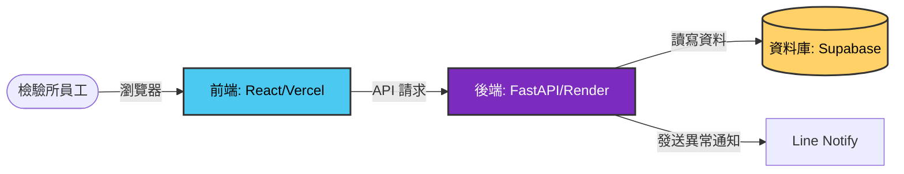
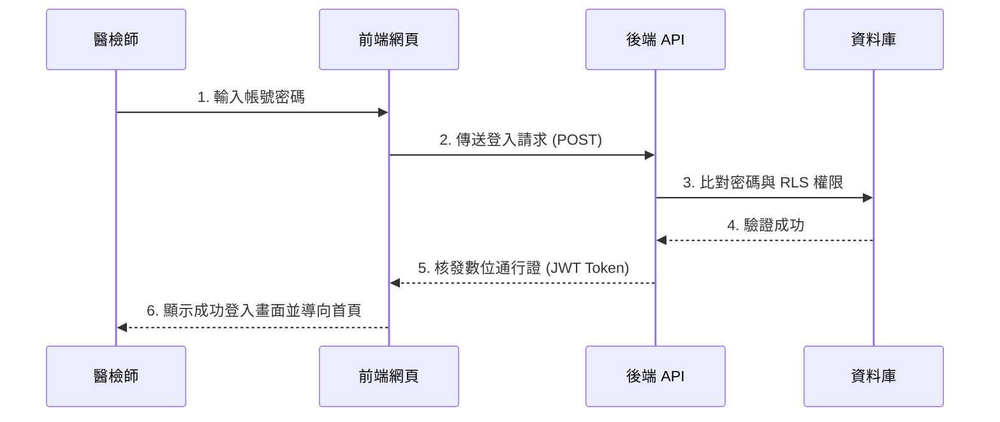
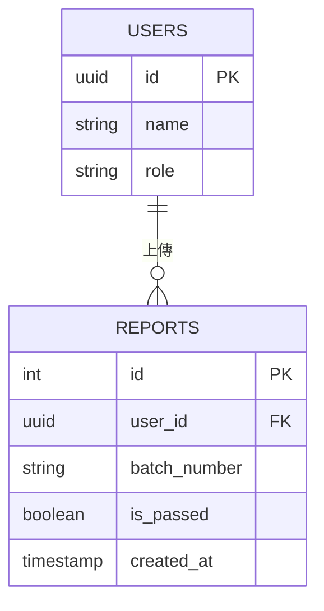

# 實務擴充：系統視覺化與 Mermaid 範本庫

## 適用對象
需要向高階主管提案、與跨部門溝通系統流程，或希望提升軟體規格書 (PRD) 專業度的架構規劃者。

## 核心觀念：Diagram as Code (畫圖即寫程式)
過去繪製流程圖，常使用 Visio 或 PowerPoint，不僅耗時且難以對齊排版。現代架構師廣泛採用 **Mermaid.js**。這是一種「將純文字轉化為圖表」的技術，完美契合 AI 時代——因為 AI 最擅長生成文字。只需給予 AI 指令，它就能直接產出結構完美的系統架構圖，且語法完全支援嵌入至 GitHub、Notion 與各類 Markdown 文件中。

---

## 實戰範本庫 (可直接複製至 [Mermaid Live Editor](https://mermaid.live/) 檢視)

### 範本一：基礎系統架構圖 (Flowchart)
**應用情境**：向主管或非技術人員展示前端、後端與資料庫之間的關聯。

### 範本二：登入與驗證循序圖 (Sequence Diagram)
**應用情境**：清楚解釋「登入機制」或「複雜業務審核流程」的先後順序。

### 範本三：資料庫實體關聯圖 (ERD)
**應用情境**：在設計初期，定義資料庫的表格架構與一對多關聯性。

---

## AI 協作秘訣 (Prompt 範例)
在實務上，完全不需要死背上述的括號與箭頭語法。請直接使用以下 Prompt 交給 AI 處理：

> 「你是一位資深系統架構師。請根據我以下的業務流程敘述，幫我用 `Mermaid` 語法產出一張『循序圖 (Sequence Diagram)』。請在節點上加上適當的顏色標註。
> 流程：使用者上傳檢驗報告 -> 系統呼叫 AI OCR 模型 -> OCR 回傳辨識結果 -> 系統比對法規標準 -> 若數值超標則發送 Line 通知給主管，否則將合格紀錄存入資料庫。」
